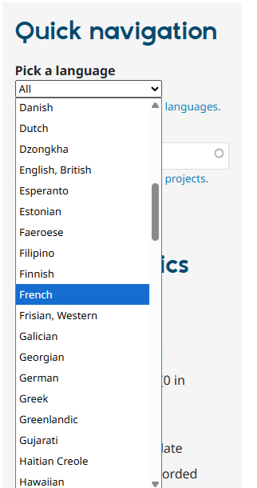
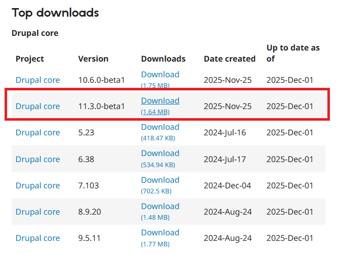
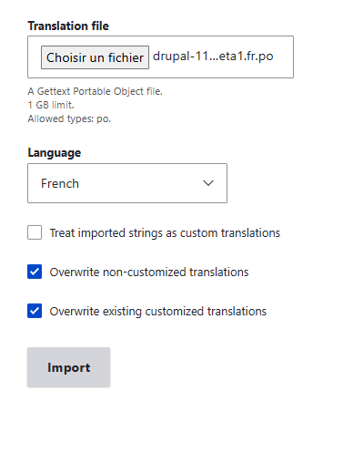
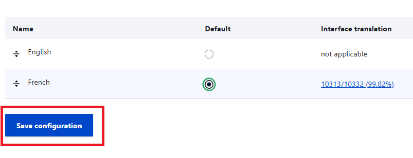

### Changer de langue

#### Ajouter la langue pour l'interface

* Home > Administration > Configuration > Region and language > Languages > Add language
* choisir la langue
* Cliquer sur "Add language"

### Récupérer le fichier de traduction de l'interface

* Home > Administration > Configuration > Region and language > User interface translation
* Cliquer sur "import"
* Cliquer sur le lien ["Drupal translation server"](https://localize.drupal.org/)
* Dans la navigation rapide, rechercher "French" puis le bouton "Go there" 
* Sur la page suivante, télécharger le fichier correspondant à la version utilisée 
* Charger le fichier en demandant de réécrire les traduciton existante ainsi que les traductions faîtes par l'utilisateur 
* Aller à Home > Administration > Configuration > Region and language > Languages 
* Choisir la langue installée comme langue par défaut 

