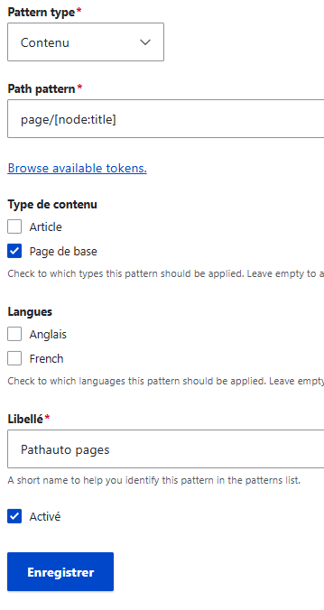

# Alias d'url

Accueil > Administration > Configuration > Recherche et metadonnées > Alias d'URL

Cliquer sur "Patterns"

Cliquer sur "Add Pathauto pattern"

Exemple pour les pages : 

* Pour acceder aux jeton, on clique sur le lien "Browse available tokens"
* Puis dans la liste on déroule "Noeuds", car un contenu page par exemble est un noeud.
* On recherche Titre et on clique sur le lien "node:title"

Il faut absolument, pour pouvoir utiliser automatiquement les alias d'url, cocher la case "Activé" avant même la création du premier contenu

**Pour les taxonomies**

Les jetons concernant les taxonomie sont "Termes de taxonomie" et une classification est le terme, donc pour, par exemple, trouver un lien qui regroupe les articles ayant comme étiquette "toto", il faut choisir le token "term:name"

