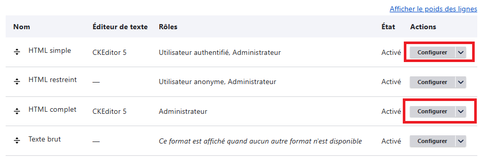
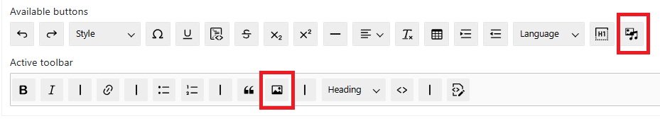
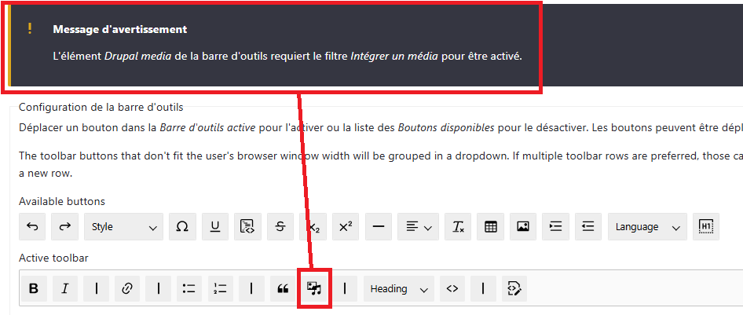
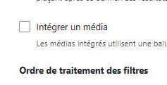
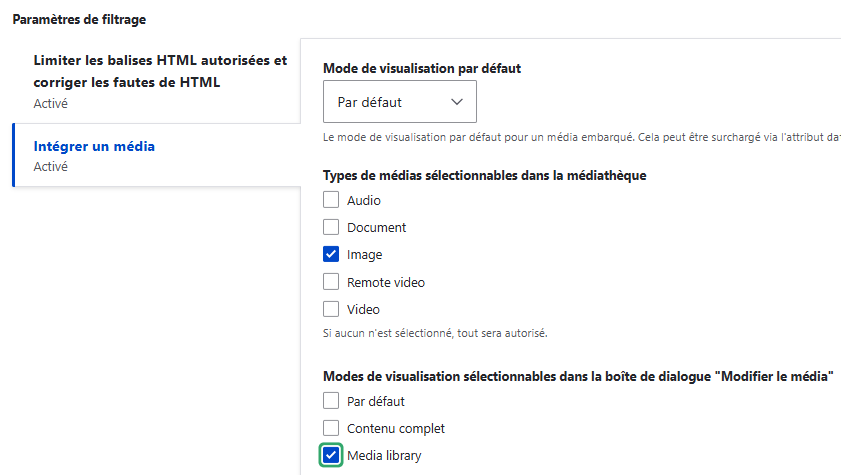

# Formats de saisie

Il faut maintenant configurer les éditeurs WYSIWYG des différents type de contenu, notamment pour les media des contenus.

Par défaut, il n'existe qu'un bouton "image", qui téléverse une image dans un répertoire etil est très difficile de retrouver facilement cette image, surtout si on cherche à l'utiliser dans plusieurs contenus.

Grâce à la "media library" installée et configurée, il est possible de remplacer dans les boutons des WYSIWYG le bouton "image" par un bouton "media"

* Accueil > Administration > Configuration > Rédaction de contenu > Formats de texte et éditeurs

Quand on utilise un éditeur de texte dans un contenu, il est possible d'avoir différents type d'éditeurs, ces éditeurs dépendent du contexte et des utilisateurs connectés lors de la rédaction

* HTML simple : quelques boutons qui permettent de mettre simplement le texte en forme, ilmité à quelques balise
* HTML complet : permet plus de balise et lors de la rédaction du contenu directement en html, autorise plus de balise
* HTML Restreint : l'éditeur est un éditeur txt, il faut écrire directement en html et seules quelques balises sont autorisées
* Texte brut : on écrit que du texte format txt, les balises html ne seront pas gardées.

Il faut au départ remplacer les boutons de téléversement d'image dans les éditeur par le bouton d'ajout de média, ce bouton permettra de charger de nouveaux media dans la media library et aussi de réutiliser des media déjà présents dedans.

**Exemple pour html simple**

Cliquer sur le bouton configurer

Prendre le bouton "image" et le placer sur la barre suppérieure
Prendre le bouton media-library et le placer sur la barre d'outils de l'éditeur

Um message prévient qu'il faut configurer maintenant les conditions d'utilisation de la media library pour l'éditeur html simple

Il faut commencer par cocher "intégrer un media" et attendre le chargement de la configuration

Dans cet exemple, le seul media utilisable pour le html simple sera les images, quand on ajoute une image on choisi l'interface de la media library
Puis on enregistre

