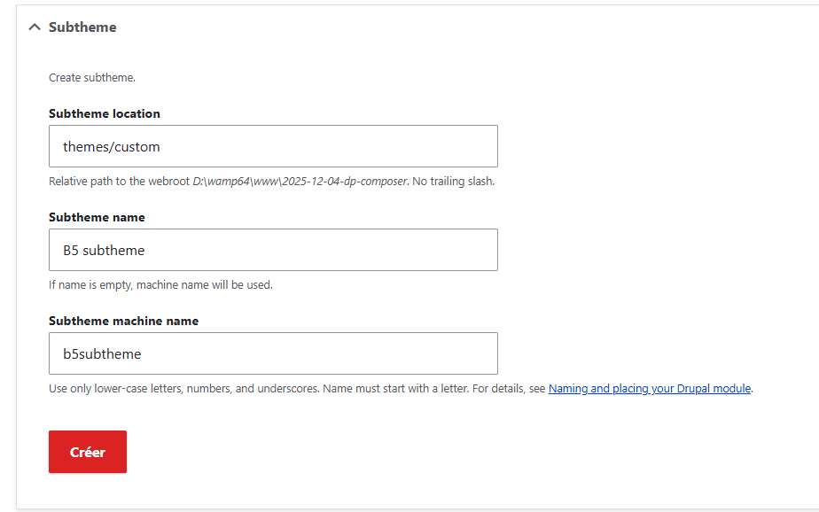

# Utiliser un thème enfant pré-généré

Il existe dans les thème contribués de Drupal le thème [bootstrap5](https://www.drupal.org/project/bootstrap5), qui permet dans l'administration du thème de créer une instance de thème enfant préconfigurée, qui est plus facile a modifier / surcharger que de créer un thème soi-même avecl'intégration d'un bootstrap dedans.



Une fois que le sous thème est créé, on l'installe et on le défini par défaut.

Pour ajouter son css, il faut créer dans le répertoire css du sous-thème un fichier css, et aller ajouter une ligne dans le fichier  .libraries.yml

Par exemple, si le fichier css s'appelle ```custom-style.css```

```yml
global-styling:
  css:
    theme:
      css/style.css: {}
      # ajouter la ligne suivante : 
      css/custom-style.css: {}
```

Après avoir vidé les caches, le CSS de ce fichier sera ajouté au css utilisé sur le site

## Ajouter des bibliothèque JS

Dans ce thème, pour ajouter des scripts JS utilisables dans le thème : 

1. Créer à la racine du thème un répertoire qui contiendra les bibliothèques utilisées
2. modifier le fichier ```libraries.yml```
pour un fichier nommé ```script.js```

```yml
global-styling:
  css:
    theme:
      css/style.css: {}
      # ajouter la ligne suivante : 
      css/custom-style.css: {}
    js:
        js/script.js: {}
```